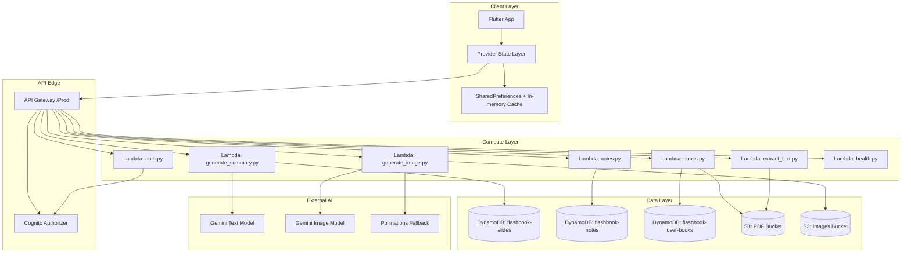
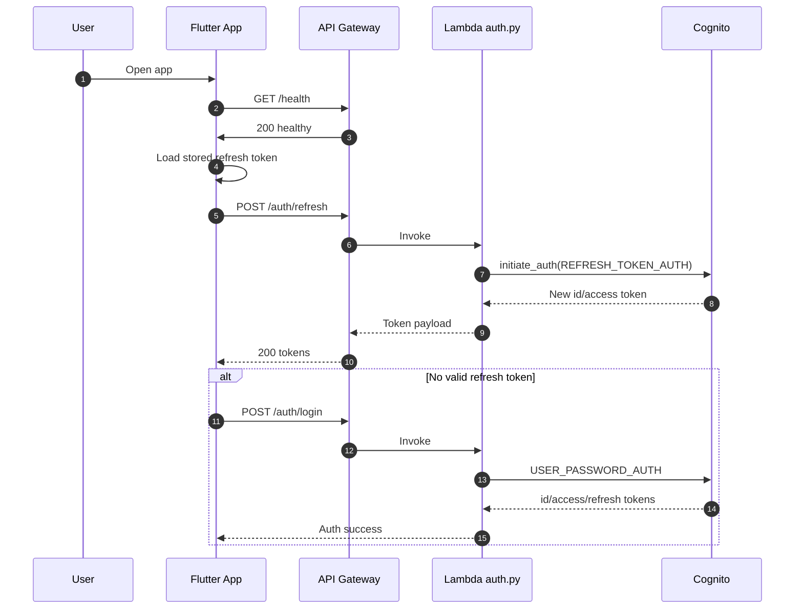
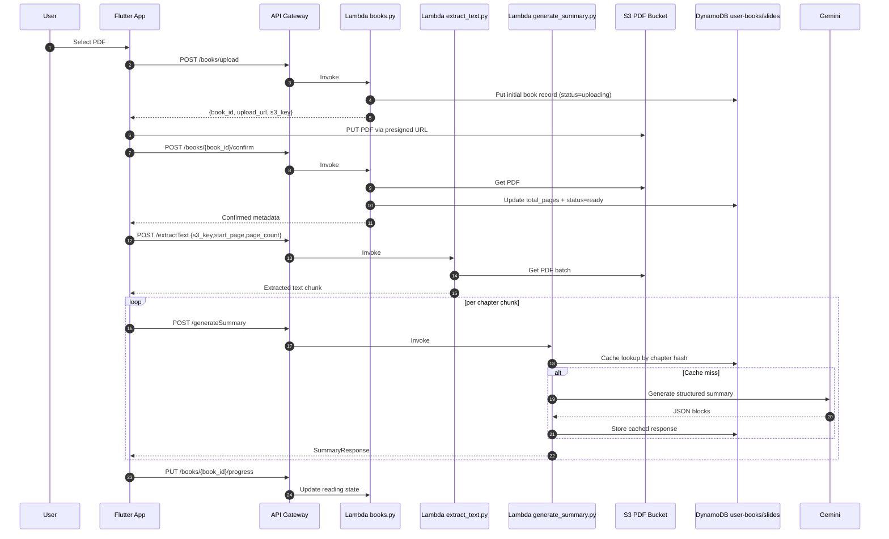
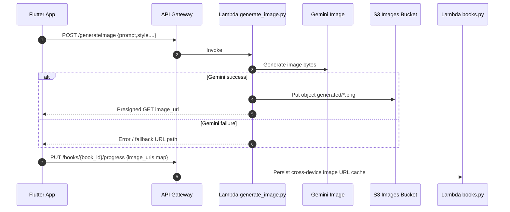
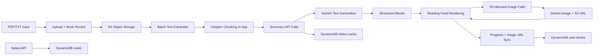
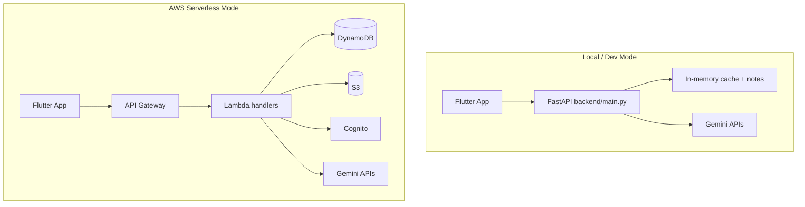

# Flashbook Architecture Diagrams (Mermaid)

## Component Diagram

## Sequence Diagram: Auth + Session Restore

## Sequence Diagram: PDF Upload and Initial Processing

## Sequence Diagram: Lazy Image Generation

## Data Flow Diagram: End-to-End

## Deployment View: Dual Backend Modes

